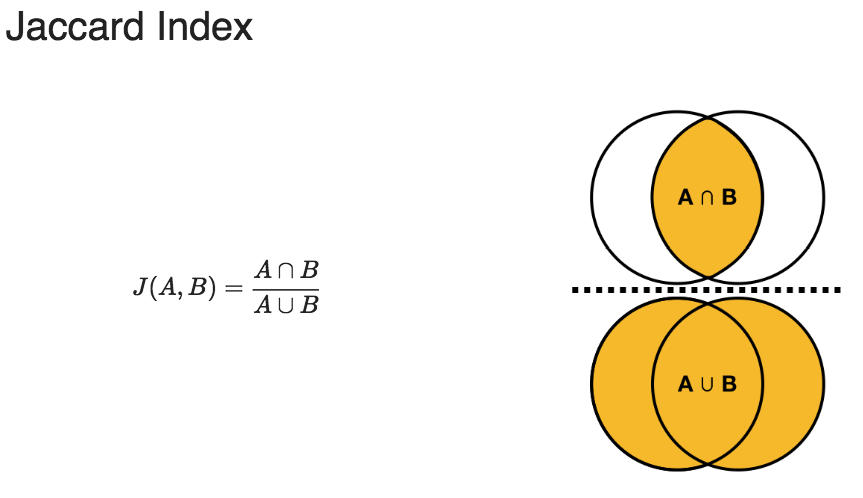

# Clustering - preparing your data

Cluster analysis is a form of exploratory data analysis (EDA) which involves grouping observations that share similar characteristics. This is done primarily by measuring the distance between observations.

What kinds of problems are suitable for cluster analysis?
- Using consumer behavior data to identify distinct segments within a market.

- Identifying distinct groups of stocks that follow similar trading patterns.

## Theory

Distance = 1-Similarity
The goal is to maximize BSS (betweeness) and minimize TWSS (total)


Before getting started we first need to make sure that our values can indeed be differentiated.

## Pre-processing
- No missing values
- Features have similar scales
- Then calculate distance

### Calculate a standardised scale (if measurements are meters and kilograms)
```{R}
scale(height_weight) #standardises to a mean of 0 and sd of 1
```

### Calculate the distance (between continuous variables)
```{R}
dist(two_players, method = "euclidean")
```

### Calculate the distance (between categorical variables)
```{R}
dist(two_players, method = "euclidean")
```

  # dummification
  library(dummies)
  dummies.data.frame()
  scale()

## Which features to use

## Clustering method

## Analyze the output for meaning
Make sure you understand the problem really well.


#scale

kmeans(x,4,nstart=20)
