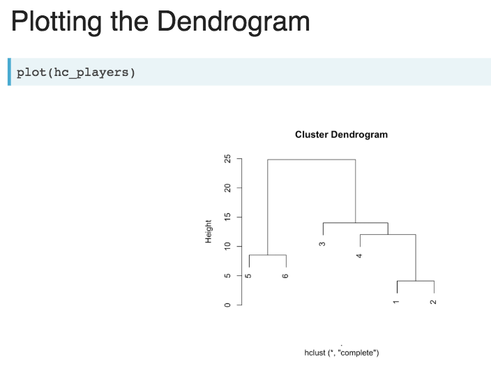

# Cluster Analysis

Cluster analysis is a form of exploratory data analysis (EDA) which involves grouping observations that share similar characteristics. This is done primarily by measuring the distance between observations. Cluster Analysis is an application of unsupervised machine learning where no training data is provided. Commonly used algorithms for clustering include: kmeans, mean-shift, dbscan, GMM and Hierarchical clustering.

What kinds of problems are suitable for cluster analysis?
- Using consumer behavior data to identify distinct segments within a market.
- Identifying distinct groups of stocks that follow similar trading patterns.

## 1. Theory

Distance = 1-Similarity
The goal is to maximize BSS (betweeness) and minimize TWSS (total)


Before getting started we first need to make sure that we standardise of measurements.

## 2. Pre-processing
- No missing values
- Features have similar scales
- Calculate distances

### Calculate a standardised scale (if measurements are meters and kilograms)
```{R}
scale(height_weight) #standardises to a mean of 0 and sd of 1
```

### Calculate the distance (between continuous variables)
```{R}
dist(two_players, method = "euclidean")
```

### Calculate the distance (between 2 categorical variables)
```{R}
dist(survey_a, method = "binary")
```


### Calculate the distance (between 3 or more categorical variables)
#### We first have to dummify our data
```{R}
library(dummies)
dummy.data.frame(survey_b)
dist(survey_a, method = "binary")
```

## 3. Which features to use


## 4. Clustering method


----------
### Hierarchical Clustering
```{R}
# Here we have continuous data which is already standardised

dist_players <- dist(players, method="euclidean")
hc_player <- hclust(dist_players, method="complete")
# hc_player <- hclust(dist_players, method="single")
# hc_player <- hclust(dist_players, method="average")

output <- cutree(hc_player, k=2)
# or we can set the height with h=15
output <- cutree(hc_player, h=15)
output # a vector which tells us where each observation belongs e.g.
# 1 1 1 1 2 2

# Append back to original data 
players_clustered <- mutate(players, group = output)

# we can now plot them
ggplot(players_clustered, aes(x=x, y=y, color=factor(cluster)))+ geom_point()

# Count the number of clusters
count(players_clustered, vars="output")
```


To see a visual representation of the tree we build a dendrogram as seen below:

```{R}
plot(players_clustered)

# coloring your dendrogram:
library(dendextend)
dend_players <- as.dendrogram(hc_player)
dend_colored <- color_branches(dend_players h=15) # set height
dend_colored <- color_branches(dend_players k=2) # set groups
plot(dend_colored)

```

Here is a complete sample:
```{R}
# Calculate Euclidean distance between customers
dist_customers <- dist(customers_spend, method="euclidean")

# Generate a complete linkage analysis 
hc_customers <- hclust(dist_customers, method="complete")

# Plot the dendrogram
plot(hc_customers)

# Create a cluster assignment vector at h = 15000
clust_customers <- cutree(hc_customers, h=15000)

# Generate the segmented customers dataframe
segment_customers <- mutate(customers_spend, cluster = clust_customers)

# Count the number of customers that fall into each cluster
count(segment_customers, cluster)

# Color the dendrogram based on the height cutoff
dend_customers <- as.dendrogram(hc_customers)
dend_colored <- color_branches(dend_customers, h=15000)

# Plot the colored dendrogram
plot(dend_colored)

# Calculate the mean for each category
segment_customers %>% 
  group_by(cluster) %>% 
  summarise_all(funs(mean(.)))

```

Here are some conclusions that you can draw

----------
### KMEANS
You've got to know k in the beginning. If you don't you can try these two techniques:
1. Elbow method (tot.withinss)
1. Silhouette analysis ()


Here is a kmeans example (based on continuous data)
```{R}
# Build a kmeans model
model_km2 <- kmeans(lineup, centers = 2)

# Extract the cluster assignment vector from the kmeans model
clust_km2 <- model_km2$cluster

# Create a new dataframe appending the cluster assignment
lineup_km2 <- mutate(lineup, cluster = clust_km2)

# Plot the positions of the players and color them using their cluster
ggplot(lineup_km2, aes(x = x, y = y, color = factor(cluster))) +
  geom_point()

```

Here is a real example with the customer data
```{R}
set.seed(42)

# Build a k-means model for the customers_spend with a k of 2
model_customers <- kmeans(customers_spend, centers=2)

# Extract the vector of cluster assignments from the model
clust_customers <- model_customers$cluster

# Build the segment_customers dataframe
segment_customers <- mutate(customers_spend, cluster = clust_customers)

# Calculate the size of each cluster
count(segment_customers, cluster)

# Calculate the mean for each category
segment_customers %>% 
  group_by(cluster) %>% 
  summarise_all(funs(mean(.)))
```


## 5. Analyze the output for meaning
Make sure you understand the problem really well.


